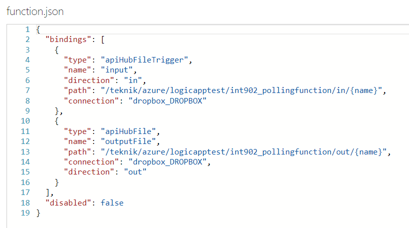

The polling for files or messages in Logic Apps can be rather costly 
if the requirements are such that the file or message must be taken 
care of within shortly.

The following blog posts addresses the case.

[Be careful of the Logic App Consumption Prizing model](https://peter.intheazuresky.com/2017/02/24/be-careful-of-the-logic-app-consumption-prizing-model/)

[Save costs by scheduling Logic Apps](https://www.codit.eu/blog/2017/03/23/save-costs-by-scheduling-logic-apps/)

One way to eliminate (almost) the polling cost is to let Azure Function triggers do the job.
The cost for that is almost nothing, only cost for function storage and execution 
of function when the function is triggered.

So how do we do this?

In this example we want to take action when a new file is stored in a Dropbox folder.

Create a new Azure function and choose External File as input trigger. 
Select Dropbox as the API Connection.

Bindings:

Function:

The function will call the Logic App, containing information about the newly created file.

The Logic App is triggered by the call from the Azure Function and the file can be processed.

REMOVE
------
Today I stumbled into this great post when I was searching for functionality to create NuGet packages in MSBuild. This was even better:

[https://ihadthisideaonce.com/2014/02/24/nuget-like-a-pro-the-msbuild-way/](https://ihadthisideaonce.com/2014/02/24/nuget-like-a-pro-the-msbuild-way/)

The trick was to enable package restore and add this line:

`<BuildPackage>true</BuildPackage>`

Thanks to Jim Counts.